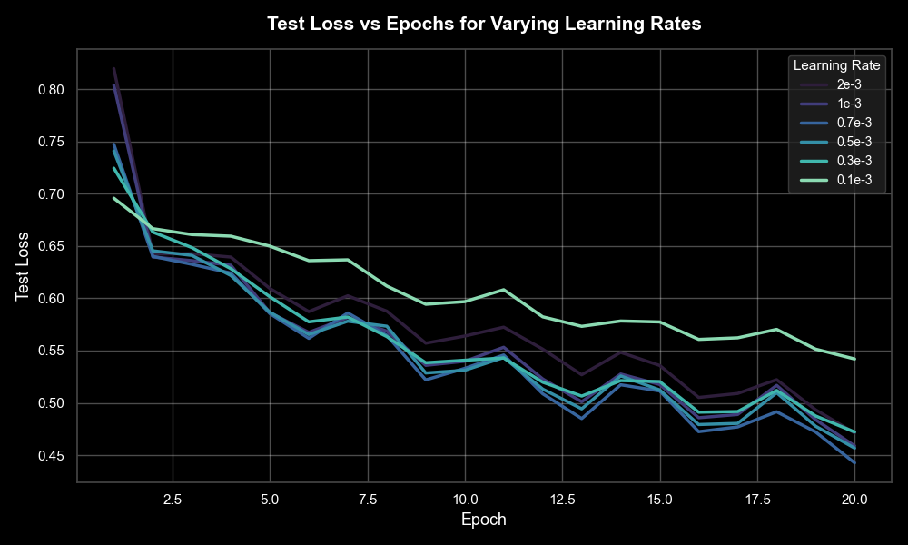
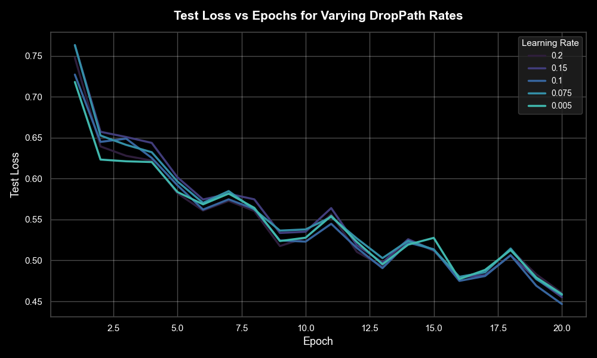
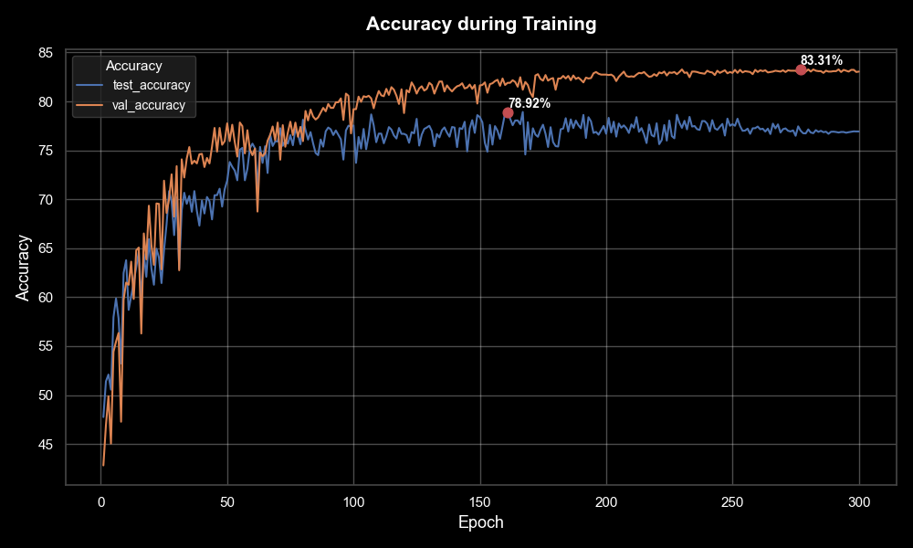
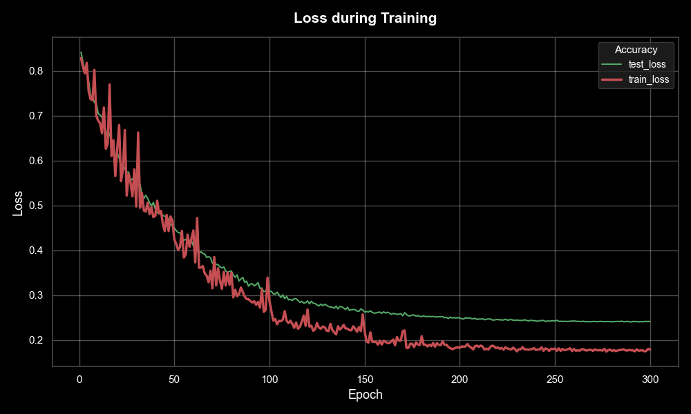
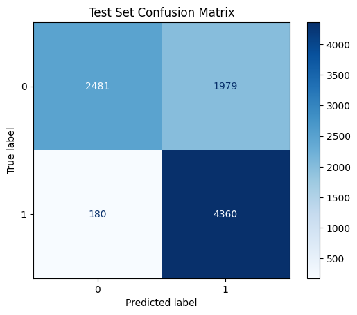

# Classificantion of Alzheimer's Disease Using ConvNeXt Network on the ADNI Dataset

*Aaron Morrow (s4642065)*

 ## Problem task

Image classification remains at the fore front of neural network research, with particular importance in the field of medical imaging. Of particular interest is the classification of various MRI scans, a task of great importance in diagnosis but constrained by the few individuals available to perform such classification. Neural networks have the potential to provide low-cost rapid classification of medical images, provided they can maintain sufficiently high standards of accuracy. 

Specifically we explore the task of Alzheimer’s Disease classification from brain MRI scans with an accuracy goal of 80%. In order to implement this task we implement a relatively new vision model architecture, then ConvNeXt [2]. 

## Model Description

The ConvNeXt model is a modern incarnation of a convolutional neural network (CNN), intended to match the performance of transformer-based models such as Vision Transformer (ViT). While maintaining the efficiency and inductive basis of CNNs, the ConvNeXt model incorporate the design of hierarchical transforms like the Swin Transformer.

The architecture is composed of the following main components:

* Stem
* Stage 1
* Stage 2
* Stage 3
* Stage 4
* Global average pool
* Linear classifier

<figure align="center">
  
  <figcaption><strong>Figure 1.</strong> General Structure of ConvNeXt model, showing stem, 4 stages of ConvNeXt blocks and classification head.</figcaption>
</figure>


**Stem**

The stem acts are the initial feature extractor. It applies a convolutional kernel (7x7 in original architecture, reduced to 5x5 in this implementation) which down samples the input image while increasing the feature dimensionality. The result is a compact, information rich representation of the image which is fed into subsequent stages.

 **Stages 1-4**

 The model is then proceeded by four hierarchical stages, each consisting of a configurable number of ConvNeXt blocks, (3,3,27,3 in original architecture, reduced to 2,2,6,2 in this implementation). Each progressive stave reduces spatial resolution via down sampling while expanding channel dimension such that the model learns progressively deeper semantic understanding of the image.


<figure align="center">
  
  <figcaption><strong>Figure 2.</strong> Structure of a ConvNeXt block showing depthwise convolution, normalization, and residual connection.</figcaption>
</figure>


**ConvNeXt Block**

Each block integrates several modern design choices for CNN's that aim to improve performance and stability. These are:

* Depthwise Convolution — captures spatial correlations efficiently within each channel.
* Layer Normalization — stabilizes training and improves convergence.
* Pointwise Linear Layers (1×1 convolutions) — project and mix channel information, with a GELU activation introducing smooth nonlinearity.
* DropPath (Stochastic Depth) — randomly drops residual paths during training for regularization.
* Residual Skip Connection — connects block input to its output, preserving gradient flow and enabling deeper model training.

In conjunction these features allow the ConvNeXt model to retain strong spatial inducive biases, while maintaining stability in training.

**Classification Head**

After the final stage, a global average pooling operation is performed which aggregates spatial information into a single feature vector. This vector is passed into a linear classifier to produce the final prediction scores for each class.


## Project Structure

Project contain the following files with purpose explained:

`train.py` - Trains the model using hyperparameters in `utils.py`

`predict.py` - Runs tests on a test set. (See usage below)

`dataset.py` - Loads the dataset for training and testing

`modules.py` - Defines the model ConvNeXt architecture

`utils.py` - Contains hyperparamters for model training

`assests` - Folder of assests for documentation


## Dataset preperation

The data set to be utilised is the ADNI dataset containing approximately 30,000 images with a preset train/test split of 21520 to 9000 or ~70% - 30% split. This test training split was maintained as, although it is a considerable testing percentage, it should allow for a reliable determination of model accuracy. A variety of preprocessing methods were applied to the training set to aid classification. 

```python
train_transform = transforms.Compose([
    transforms.Grayscale(num_output_channels=1),
    transforms.ColorJitter(brightness=0.15, contrast=0.15),                       # Brightness alterations
    transforms.Resize((224,224)),                                                 # Set to square dims for Model 
    transforms.RandomHorizontalFlip(p=0.5),                                       # Random horizontal flip
    transforms.RandomRotation(12),                                                # Random rotation ±12 degrees
    transforms.RandomAffine(degrees=0, translate=(0.05,0.05), scale=(0.95,1.05)), # Random Translation and scale
    transforms.ToTensor(),                                       
    transforms.Normalize(mean=[MEAN], std=[STD])                                  # Normalisation
    ])
```

The above data augmentation was applied to training data. Augmentations included a resize to $240\times 240$ square dimensions for ease of processing. All images were normalised according to calculated average and standard deviation of the training set. Various augmentations were applied including, random flipping, rotation, affine translations and scales and colour jitter. This was necessary to prevent model overfitting by introducing more variety into the training data set, was shown in improve model accuracy with sufficient epochs. 

Data is provided to ```dataset.py``` as a path to the data folder. The model requires the data to be pre-separated between train and test classes, and to be organised using the following structure.  
 

```python
ADNI/
├── train/
│   ├── AD
│   │   ├── trainAD_1.jpeg
│   │   ├── trainAD_2.jpeg
│   │   └── ...
│   ├── NC
│   │   ├── trainNC_1.jpeg
│   │   ├── trainNC_2.jpeg
│   │   └── ...
├── test/
│   ├── AD
│   │   ├── testAD_1.jpeg
│   │   ├── testAD_2.jpeg
│   │   └── ...
│   ├── NC
│   │   ├── testNC_1.jpeg
│   │   ├── testNC_2.jpeg
│   │   └── ...
```


## Code dependencies
```
python==3.13.5
torch==2.7.1+cu118
torchvision==0.22.1+cu118
torchaudio==2.7.1+cu118
timm==1.0.20

numpy==2.1.2
pandas==2.2.3        # To save results
matplotlib==3.10.6
tqdm==4.67.1
Pillow==11.0.0

scikit-learn==1.5.2   # for confusion matrix
```

## Testing
**Model Size**

Of primary importance in creating the model was the selection of the model size, how many ConvNeXt blocks would be utilised in each layer. The model proposed in the original paper is (3,3,27,3), which is a very large model. As their model was trained on the ImageNet-1k data set tuning such a large number of parameters is possible given that contains 1,281,167 training images. However, for our much smaller training set, at just 21,520 images or 1.68% of the size, a much smaller model would be required. Indeed, initial testing using a full ConvNeXt model showed an inability to learn, by failing to decrease loss below ~0.608 or accuracy above 50.4%. 

**Hyperparameter Selection**

Trials were conducted to determine ideal hyperparameters. Shown below are example trials results, testing models with varying parameters of 20 epochs. 

<p align="center">
  
  
</p>

These tests found the ideal learning rate at $0.75\times 10^{-3}$ and ideal drop path rate at $0.1$. Further testing was conducted on various other parameters. All selected hyperparamters are listed below.

Hyperparamters
* **Batch size: 128** Number of images model processes before propagatting weights
* **Learning Rate: 0.75e-3** Determines how much to adjust model weights with respect to loss
* **Drop Path Rate: 0.1** Controls probability of dropping blocks during training
* **Model Depth: (2,2,6,2)** Number of ConvNeXt blocks in each layer
* **Epochs: 300** Number of times model is processes entire training set
* **Optimiser: AdamW** Optimisation algorithm to update model weights
* **Scheduler: OneCycleLR** Alters the learning rate over training epochs
* **Loss Criterion: CrossEntropyLoss** Determines variance between predicted and true classifications

## Usage

**``train.py``**

No arguments, training parameters supplied by ``utils.py``

Example:
```python
train.py
```

---


**``predict.py``**: 
```python
python predict.py [-h | --help]
                  [-e | --evaluation]
                  [-b BATCH_SIZE | --batch_size BATCH_SIZE]
                  model path
```
Non-Optional Arguments
* model: path to the trained mode .pth file, file will ahve been created by ``train.py``
* path: path to either a single image (for individual inference) or a data set director (for full set evaluation). Diretoy should contain ``train/``, ``val/`` and ``test/`` subfolders.

Example: 
```python
python predict.py ./outputs/ConvNeXt_best.pth ./data/ADNI/AD_NC
```

Optional Arguments
* -e, --evaluation: enables evaluation mode, model is run on entire test dataset, and returns test accuracy, loss and confusion matrix
* -b, --batch_size: Specifies batch size during data set evaluation (default: 64). Argument is ignored in single-image mode

Example:
```python
python predict.py ./outputs/ConvNeXt_best.pth ./data/ADNI/AD_NC -e -b 128
```
## Outputs
**Training Outputs**

Models were trained over the ADNI trainind set.  A validation split of 10% was made to the training set. The split of 10% was deemed sufficiently large to produce representative validation accuracies without excessively diminishing the number of images the model could learn from.

Example output from ```train.py```:
```python
...
Epoch [297/300] | Train Loss: 0.2012 | Val Loss: 0.1996 | Val Acc: 76.91% | Test Acc: 75.90% | LR: 0.000001
Epoch [298/300] | Train Loss: 0.2008 | Val Loss: 0.2006 | Val Acc: 76.91% | Test Acc: 75.94% | LR: 0.000001
Epoch [299/300] | Train Loss: 0.2012 | Val Loss: 0.2061 | Val Acc: 76.67% | Test Acc: 75.93% | LR: 0.000001
Epoch [300/300] | Train Loss: 0.2008 | Val Loss: 0.2036 | Val Acc: 76.72% | Test Acc: 75.93% | LR: 0.000001

Training completed in 293.34 min. Best Val Acc = 80.03%
Saved final model to outputs/ConvNeXt_final.pth
Saved metrics to outputs/
Saved training curves to outputs/training_curves.png
```

Outputs directory structure:
```python
outputs/
├── training_curves.png
├── losses.csv
├── accuracy.csv
├── ConvNeXt_final.pth
├── ConvNeXt_best.pth
```

**Prediction Outputs**

Example outputs from ```predict.py```:
```python
Running dataset evaluation...
Computing dataset normalization parameters...
Calculating mean/std: 100%|██████████████████████████████| 337/337 [00:25<00:00, 13.19it/s]
 Computed mean=[0.11559099704027176], std=[0.21978603303432465]
Split training data into 19368 train and 2152 validation samples.
Loaded 19368 train, 2152 val, and 9000 test samples.
== Evaluating on dataset ==
Accuracy: 78.01% | Avg Loss: 0.7945
Confusion Matrix:
 [[2481 1979]
 [ 180 4360]]
Final Test Accuracy: 78.01% | Avg Loss: 0.7945
```


## Results

<p align="center">
  
</p>

Plot above demonstrates the accuracy of the model over the training epochs. Model accuracy on the validation set shown in orange,  climbs steadily over the training period and reaches a maximum accuracy of 83.31% late into the training at epoch 277. This is higher then the maximum test accuracy of 78.92%, which occurred much earlier at epoch 159, suggesting the validation test set may not be as representative as the test dataset. This is not surprising, given the  validation set is half the size of the test and so is less likely to be representative. However, the model was unable to achieve the desired 80% test accuracy, with accuracy failing to significantly increase past 150 epochs, suggesting potential overfitting. 


<p align="center">
  

</p>

Both training and validation losses decrease over the training period as expected. Here test loss does not decrease as far as training loss, again this is a as expected when it contains unseen images. 

<p align="center">
  

</p>

The model confusion matrix demonstrates a bias to overclassifying AD (0) class as NC (1). A high precision of 93.3%, compared to low recall of 55.7% demonstrates the models conservative predictions. When it predicts AD, it is usually correct, but fails to detect AD symptoms often.


## Conclusion

The generated model was able to perform to reasonable accuracy standards at 78.92%, but failed to reach targeted 80%. Loss and accuracy analysis shows the model tendency to overfit, suggesting increased data augmentation or increased regularisation from dropout may increase accuracy. However, trials with these changes showed extremely volatile training which proved difficult work with. Model bias to classifying cases as NC, was identified with a strong tendency for conservative AD diagnosis. Whilst this may be desirable in some circumstances where treatment cares high risk, as this is not the case for AD treatments this is an undesirable outcome.


## References


[1]: A. Erdogan, *ConvNeXt — Next Generation of Convolutional Networks*, Medium 2023. Available: https://medium.com/@atakanerdogan305/convnext-next-generation-of-convolutional-networks-325607a08c46

[2]: Z. Liu, H. Mao, C.-Y. Wu, C. Feichtenhofer, T. Darrell, and S. Xie, “A ConvNet for the 2020s,”
arXiv:2201.03545 [cs], Mar. 2022, arXiv: 2201.03545. [Online]. Available: http://arxiv.org/abs/2201.03545
