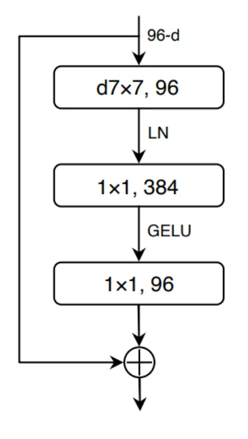

# Classificantion of Alzheimer's Disease Using ConvNeXt Network on the ADNI Dataset

*Aaron Morrow (s4642065)*

Image classification remains at the fore front of neural network research, with particualr importance in the field of medical imaging. Of particular interest is the calssifcation of various MRI scans, a task of great importance in diagnosis but constrained by the few individuals available to perform such classification. Neural networks have the potential to provide low-cost rapid classification of medical images, provided they can maintain sufficiently high standards of accuracy. 

Specifically we explore the task of Alzheimers Disease classifcation from brain MRI scans with an accuracy goal of 80%. In order to implement this task we implement a relatively new vision model archetecture, then ConvNeXt (cite). 

**About the model**
The ConvNeXt model is a modern incarnation of a convolutional neural network (CNN), redisigned to match the performance of other trasnformer-baed models such as the Vision Transformer (ViT). it inherets a strucutre similar to hierarchical transformers like the Swin Transformer, consisting of:
* Stem
* Stage 1
* Stage 2
* Stage 3
* Stage 4
* Global average pool
* Linear classifier


The stem applies the convolution layer (a 7x7 kernel in the original architecitecture, reduced to ___ here) to dounsample the input image and increase feature dimensions. Then each of the four stages contains a set of ConvNeXt blocks, with the number of blocks per stage set by a configureation (3, 3, 27, 3 in original architecture, reduced to _____ here). As it can be seen in the below image, each block is comprised of layers which down sample spatial resolution.



At the same dimenstionality increases as (______). The block includs a layer nomalisation, usefeul for stabilising training. Normalised feautres are then pased thorugh point wise linear layers, applying a GELU activation function for smooth nonlinrarity. Additionally the model contains a DropPath module to stochastic depth regularisation and a residual skip connection connecting the blocks inpu to output. THis allows forhte preservation of gradient flow, enabling deep model learning. After the final block, a global average pooling layers is applied across the spatial information creasting a single vector, which is then pased toa linear classifier to produce the final class. It is the combination of these factors which allows the model to achieve trasnformer level accuracy. 

**Project Structure**

Project contain the following files with purpose explained:

`train.py` - Trains the model using hyperparameters in `utils.py`

`predict.py` - Runs tests on a test set. (See usage below)

`dataset.py` - Loads the dataset for training and testing

`modules.py` - Defines the model ConvNeXt architecture

`utils.py` - Contains hyperparamters for model training

`assests` - Folder of assests for documentation


**Dataset preperation**

The data set to be utilised is the ADNI dataset containing approximately 30,000 images with a preset train/test splot of 21520 to 9000 or ~70% - 30% split. This test training split was maintained as, although it is a considerable testing percentage, it should allow for a reliable determination of model accuracy. A variety of preprocessing methods were applied ot the training set to aid classification. 

```python
train_transform = transforms.Compose([
    transforms.Grayscale(num_output_channels=1),
    transforms.ColorJitter(brightness=0.15, contrast=0.15),                       # Brightness alterations
    transforms.Resize((224,224)),                                                 # Set to square dims for Model 
    transforms.RandomHorizontalFlip(p=0.5),                                       # Random horizontal flip
    transforms.RandomRotation(12),                                                # Random rotation ±12 degrees
    transforms.RandomAffine(degrees=0, translate=(0.05,0.05), scale=(0.95,1.05)), # Random Translation and scale
    transforms.ToTensor(),                                       
    transforms.Normalize(mean=[MEAN], std=[STD])                                  # Normalisation
    ])
```

EXPLAIN ABOVE


**Code dependencies**
* python
* torch
* numpy
* torch vision
* timm
* PIL


Data utilised

* data selection
* data set split test/train
* data transforms seclections

**Training**

Models were trained over the ADNI training set using the training loop ......

* training process.
* explain training loop

### Testing
**Model Size**

Of primary importance in creating the model was the seclection of the model size, how manny ConvNeXt blocks would be utilised in each layer. The model proposed in tyhe original paper is (3,3,27,3), which is a very large model with ___ parameters. As their model was trained on the ImageNet-1k data set tuning such a large number of parameters is possible given that contains 1,281,167 training images. However for our much smaller training set, at just 21,520 images or 1.68% of the size, a much smaller model would be required. Indeed initial testing using a full ConvNeXt model showed an inability to learn, by failing to decrease loss below ~0.608 or accuracy above 50.4%. 

**Hyperparameter Selection**

Trials were conducted to determine ideal learning rate, as shown below. Ideal rate using ?one-cycle? was found as 0.7e-3. 

PLOT

Further testing was conducted on weight decay asnd drop path rates, concluding ideal values at 0.75e-3 and 0.1 respectively.

PLOTS

Additional choices which were found to be most optimal include:
* batch_size 128:
* Epochs
* Optimiser
* Schdule
* loss criterion

### Usage

**``train.py``**

No arguments, training parameters supplied by ``utils.py``

Example:
```python
train.py
```

---


**``predict.py``**: 
```python
python predict.py [-h | --help]
                  [-e | --evaluation]
                  [-b BATCH_SIZE | --batch_size BATCH_SIZE]
                  model path
```
Non-Optional Arguments
* model: path to the trained mode .pth file, file will ahve been created by ``train.py``
* path: path to either a single image (for individual inference) or a data set director (for full set evaluation). Diretoy should contain ``train/``, ``val/`` and ``test/`` subfolders.

Example: 
```python
python predict.py ./outputs/ConvNeXt_best.pth ./data/ADNI/AD_NC
```

Optional Arguments
* -e, --evaluation: enables evaluation mode, model is run on entire test dataset, and returns test accuracy, loss and confusion matrix
* -b, --batch_size: Specifies batch size during data set evaluation (default: 64). Argument is ignored in single-image mode

Example:
```python
python predict.py ./outputs/ConvNeXt_best.pth ./data/ADNI/AD_NC -e -b 128
```


RESULTS
* show higest results
* show confusion matrix
* limitations


refs: 
images https://medium.com/@atakanerdogan305/convnext-next-generation-of-convolutional-networks-325607a08c46